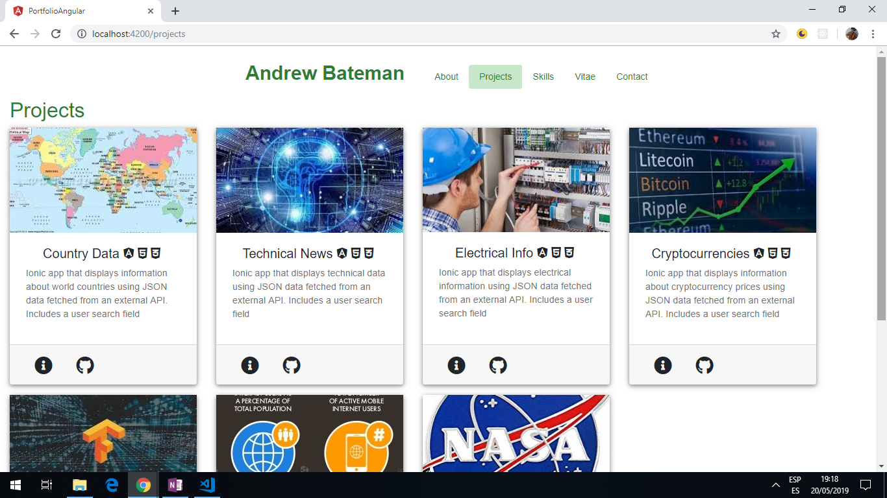
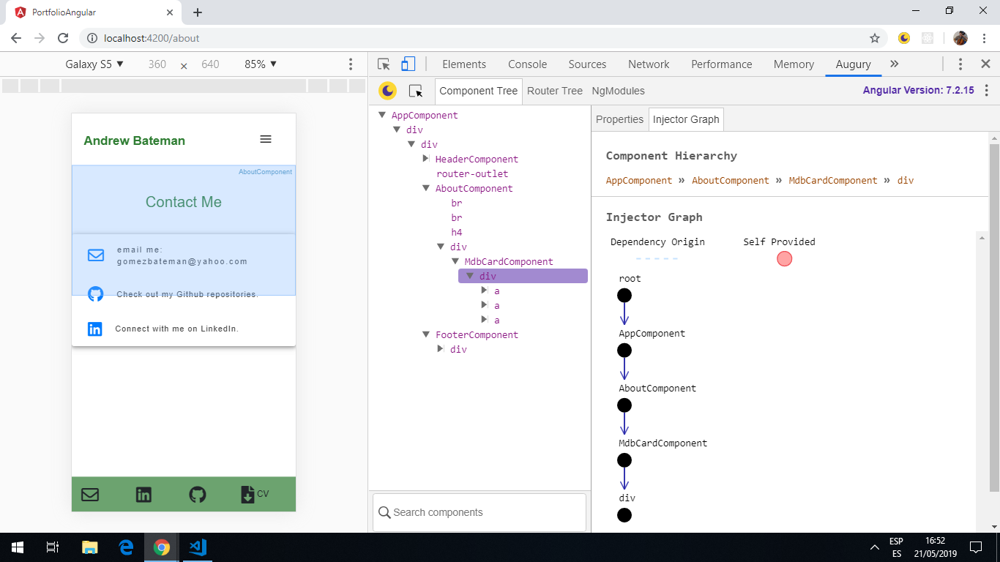

# Portfolio Angular

Angular 8 app using Angular Bootstrap to create a portfolio website.

*** Note: to open web links in a new window use: _ctrl+click on link_**

## Table of contents

* [General info](#general-info)
* [Screenshots](#screenshots)
* [Technologies](#technologies)
* [Setup](#setup)
* [Features](#features)
* [Status](#status)
* [Inspiration](#inspiration)
* [Contact](#contact)

## General info

* Responsive - media sizes for PC and phone-sized screens (max width 400px).

## Sections info

* **Header:** Working nav-bar.

* **Home:** template added. Background colour, menu and button colors based on Dropbox website. Using only mdb-icons icons. Remove fontawesome as bloat? Add real content

* **About:** 2 column layout with cards for photos on left taking 3/12 width and cards in 9/12 width column for text. Add real content.

* **Projects:** Background image works. Bootstrap card-deck with cards to display project data using data-binding from an array of projects based on a Project model. Cards are sized so up to 4 will show on a row before wrapping to the next line. Image sized to 16:9 ratio which for width 288px = height 162px. Content to be replaced.

* **Articles:** Background image works. Bootstrap card-deck with cards to display article data using data-binding from an array of articles based on an Article model. Cards are sized so up to 4 will show on a row before wrapping to the next line. Image sized to 16:9 ratio which for width 288px = height 162px. Content to be replaced.

* **Skills:** Background image does not fill screen. Bootstrap card-deck with cards to display article data using data-binding from an array of skills based on a Skill model. Cards are sized so up to 4 will show on a row before wrapping to the next line. Work out how to add 2nd level so 1 group of cards under Programming and Engineering - 2 level skills array for example.

* **vitae dropdown: experience:** Bootstrap cards display experience data using data-binding from an array of experience based on an experience model. Work out how to separate cards. Add data.

* **vitae dropdown: education:** Bootstrap cards display education data using data-binding from an array of education based on an education model. Work out how to separate cards. Add data.

* **vitae dropdown: other:** tba. List using Bootstrap cards. Add link to rare diseases etc. music, house.

* **Contact:** Single Boostrap card with links to email, github and linkedin. Background image not covering page.

* **CV Download:** Finish 1-page CV that links to CV button on right.

## Screenshots




## Technologies

* [Angular CLI v8.0.1](https://github.com/angular/angular-cli)

* [Angular framework v8.0.0](https://angular.io/)

* [Angular Material v8.0.0](https://material.angular.io/)

* [MDBootstrap Angular v7.5.3](https://mdbootstrap.com/) & [github repo: Angular-Bootstrap-with-Material-Design](https://github.com/mdbootstrap/Angular-Bootstrap-with-Material-Design)

* [MDBootstrap icons](https://mdbootstrap.com/docs/jquery/content/icons-list/)

## Setup

Run `ng serve` for a dev server. Navigate to `http://localhost:4200/`. The app will automatically reload if you change any of the source files.

Run `ng build` to build the project. The build artifacts will be stored in the `dist/` directory. Use the `--prod` flag for a production build.

Run `ng test` to execute the unit tests via [Karma](https://karma-runner.github.io).

Run `ng e2e` to execute the end-to-end tests via [Protractor](http://www.protractortest.org/).

## Code Examples

```typescript
export class Project {
  title: string;
  img: { src: string, alt: string };
  content: string;
  tools: { prefix: string, icon: string } [];
  github: string;
  url: string;
}

```

## Features

* [Angular Material Theming](https://material.angular.io/guide/theming), based on [Material Design spec](https://material.io/archive/guidelines/style/color.html#color-color-palette) colors are used for primary, accent, warning, foreground and background palletes etc.

## Status & To-Do List

* Status: In development. Compiles. All components created and routing works to all pages. HEader, Footer, Projects pages initial info added.

* To-Do: see Sections Info above.

## Inspiration

* [website by Julian Rubiano](http://www.julienrubiano.fr/)

* [website by Jaxon Wright](https://jaxonwright.com/)

* [Medium article by Tomas Trajan: The complete guide to Angular Material Themes](https://medium.com/@tomastrajan/the-complete-guide-to-angular-material-themes-4d165a9d24d1)

## Contact

Created by [ABateman](https://www.andrewbateman.org) - feel free to contact me!
